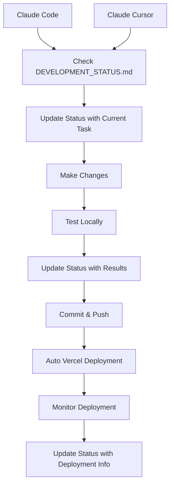

# 🤖 AI Development Workflow - Parallel Claude Collaboration System

[](https://opensource.org/licenses/MIT)
[](https://claude.ai)
[](https://cursor.sh)
[](https://vercel.com)

> **A comprehensive system for coordinating parallel AI development between Claude Code and Claude Cursor, with automatic Vercel deployment integration.**

## 🎯 **What This Repository Provides**

This repository contains everything you need to set up a seamless parallel development workflow where **Claude Code** and **Claude Cursor** can work together on the same project without conflicts, with automatic deployment to Vercel.

### ✨ **Key Features**

- 🔄 **Parallel AI Coordination** - Both AIs work on the same codebase simultaneously
- 📊 **Real-time Status Tracking** - Live communication between AI systems
- 🚀 **Auto-deployment** - Git push triggers automatic Vercel deployment
- 🛠️ **Error Prevention** - Comprehensive error handling and prevention guides
- 📱 **Device Agnostic** - Works on any laptop/desktop with the same setup
- 🧠 **Persistent Memory** - AI systems remember the workflow across sessions

## 🚀 **Quick Start**

### **1. Clone This Repository**
```bash
git clone https://github.com/mrmoe28/ai-development-workflow.git
cd ai-development-workflow
```

### **2. Set Up Claude Code Memory**
1. Open `CLAUDE_MEMORY_CARD.md`
2. Copy the entire memory section
3. Paste into your Claude Code user memory
4. Now Claude Code knows the workflow on any device!

### **3. Set Up Quick Reference System (Recommended)**
```bash
# Set up aliases for easy access from any directory
./scripts/setup-aliases.sh

# Reload your shell profile
source ~/.zshrc  # or ~/.bashrc
```

### **4. Use Quick Reference Commands**
```bash
# From any directory, access workflow files without adding them to your app:
workflow-memory    # Show Claude memory card
workflow-error     # Show error prevention guide
workflow-status    # Show development status template
workflow-setup     # Show workflow setup guide
workflow-docs      # Show main documentation
workflow-list      # List all available files
```

### **5. Alternative: Copy Files to Your Project**
```bash
# Only if you want files in your project directory
cp templates/* /path/to/your/project/
cp scripts/* /path/to/your/project/scripts/
```

## 📁 **Repository Structure**

```
ai-development-workflow/
├── README.md                           # This comprehensive guide
├── CLAUDE_MEMORY_CARD.md              # Quick reference for Claude Code
├── CLAUDE_WORKFLOW_SETUP.md           # Detailed setup instructions
├── templates/                          # Template files for projects
│   ├── DEVELOPMENT_STATUS.md          # Communication hub template
│   ├── ERROR_PREVENTION_GUIDE.md      # Error handling template
│   └── .gitignore                     # Git ignore template
├── scripts/                           # Utility scripts
│   ├── check-deployment.sh            # Deployment status checker
│   ├── setup-project.sh               # Project initialization script
│   └── sync-status.sh                 # Status synchronization script
├── docs/                              # Documentation
│   ├── SETUP_GUIDE.md                 # Detailed setup guide
│   ├── TROUBLESHOOTING.md             # Common issues and solutions
│   └── BEST_PRACTICES.md              # Development best practices
└── examples/                          # Example implementations
    ├── nextjs-project/                # Next.js project example
    ├── react-project/                 # React project example
    └── nodejs-project/                # Node.js project example
```

## 🔧 **Core Components**

### **1. Development Status System**
- **File**: `DEVELOPMENT_STATUS.md`
- **Purpose**: Real-time communication between AI systems
- **Features**: Task tracking, deployment status, issue logging

### **2. Error Prevention Guide**
- **File**: `ERROR_PREVENTION_GUIDE.md`
- **Purpose**: Common errors and their solutions
- **Features**: TypeScript errors, build failures, deployment issues

### **3. Deployment Monitoring**
- **Script**: `scripts/check-deployment.sh`
- **Purpose**: Quick status checks and deployment monitoring
- **Features**: Vercel status, git activity, build verification

### **4. Memory System**
- **File**: `CLAUDE_MEMORY_CARD.md`
- **Purpose**: Persistent memory for Claude Code
- **Features**: Workflow protocols, common commands, project context

## 🎮 **How It Works**

### **Parallel Development Flow**


### **Communication Protocol**
1. **Before Work**: Check `DEVELOPMENT_STATUS.md`
2. **During Work**: Update status with current task
3. **After Work**: Update status with completion and deployment info
4. **Emergency**: Use `ERROR_PREVENTION_GUIDE.md` for quick fixes

## 🛠️ **Setup for Different Project Types**

### **Next.js Projects**
```bash
# Copy Next.js specific templates
cp templates/nextjs/* /path/to/your/nextjs/project/
```

### **React Projects**
```bash
# Copy React specific templates
cp templates/react/* /path/to/your/react/project/
```

### **Node.js Projects**
```bash
# Copy Node.js specific templates
cp templates/nodejs/* /path/to/your/nodejs/project/
```

## 📊 **Monitoring & Status**

### **Check Deployment Status**
```bash
./scripts/check-deployment.sh
```

### **View Recent Activity**
```bash
git log --oneline -10
```

### **Monitor Vercel Deployments**
```bash
vercel ls
```

## 🚨 **Emergency Procedures**

### **Build Failures**
1. Check `ERROR_PREVENTION_GUIDE.md`
2. Run project-specific fix commands
3. Test locally before pushing
4. Update status with resolution

### **Deployment Failures**
1. Check Vercel logs: `vercel logs`
2. Verify environment variables
3. Check for TypeScript errors
4. Update status with issue details

### **AI Coordination Issues**
1. Check `DEVELOPMENT_STATUS.md` for conflicts
2. Use git to resolve merge conflicts
3. Update status with resolution
4. Continue development

## 🎯 **Best Practices**

### **For Claude Code**
- Always check status before starting work
- Update status when beginning/completing tasks
- Use descriptive commit messages
- Reference error prevention guide for issues

### **For Claude Cursor**
- Monitor status file for updates
- Coordinate through git commits
- Use deployment monitoring scripts
- Follow established workflow protocols

### **For Both AIs**
- Communicate through status file
- Test locally before pushing
- Use consistent commit message format
- Monitor deployment status

## 🔄 **Workflow Examples**

### **Starting a New Feature**
1. Check `DEVELOPMENT_STATUS.md`
2. Update status: "Starting feature X"
3. Make changes and test locally
4. Update status: "Feature X completed, testing"
5. Commit and push
6. Update status: "Feature X deployed"

### **Fixing a Bug**
1. Check `ERROR_PREVENTION_GUIDE.md`
2. Update status: "Fixing bug Y"
3. Apply fix and test
4. Update status: "Bug Y resolved"
5. Commit and push
6. Update status: "Bug Y fix deployed"

## 📚 **Documentation**

- **[Setup Guide](docs/SETUP_GUIDE.md)** - Detailed setup instructions
- **[Troubleshooting](docs/TROUBLESHOOTING.md)** - Common issues and solutions
- **[Best Practices](docs/BEST_PRACTICES.md)** - Development guidelines
- **[API Reference](docs/API_REFERENCE.md)** - Script and tool documentation

## 🤝 **Contributing**

We welcome contributions to improve this workflow system! Please:

1. Fork the repository
2. Create a feature branch
3. Make your changes
4. Test thoroughly
5. Submit a pull request

## 📄 **License**

This project is licensed under the MIT License - see the [LICENSE](LICENSE) file for details.

## 🙏 **Acknowledgments**

- **Claude Code** - For powerful AI development capabilities
- **Claude Cursor** - For seamless IDE integration
- **Vercel** - For automatic deployment infrastructure
- **GitHub** - For version control and collaboration

## 📞 **Support**

If you encounter any issues or have questions:

1. Check the [Troubleshooting Guide](docs/TROUBLESHOOTING.md)
2. Review the [Best Practices](docs/BEST_PRACTICES.md)
3. Open an issue on GitHub
4. Check the status file for current project state

---

**Happy coding with parallel AI development! 🚀**

*This workflow system ensures seamless collaboration between Claude Code and Claude Cursor, making your development process more efficient and coordinated.*
